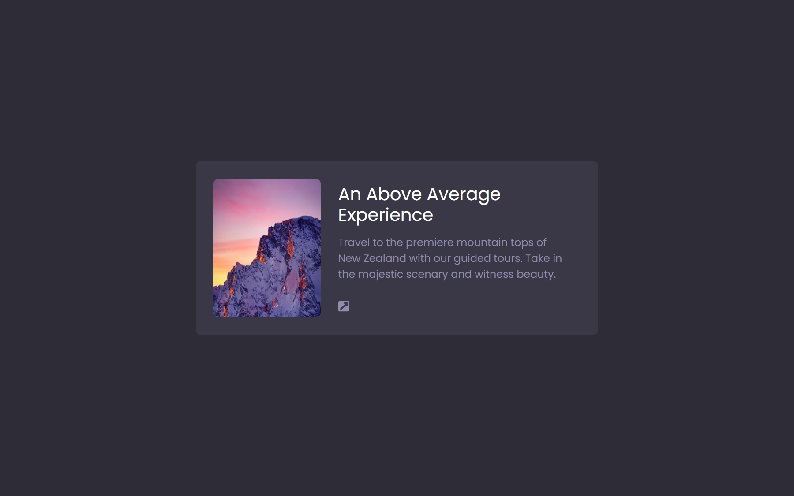
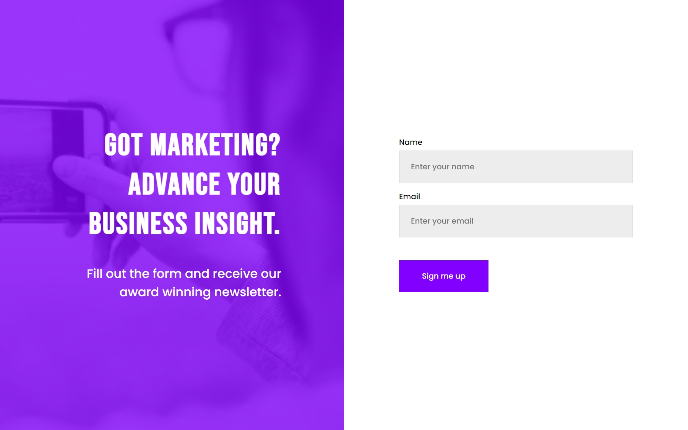
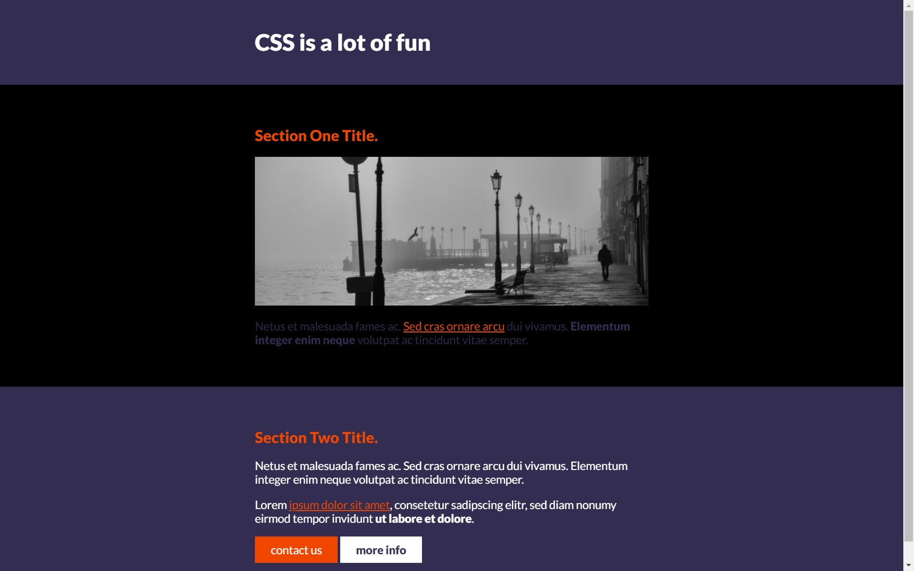

# Scrimba-course
This repository contains some tasks and solo projects that i have done as part of my frontend course on scrimba platform

## Some challenges Tackled

  #### **Click the Pictures to go the the live view**

> ## In Figma-To-Code-Course
>
> * Data-Analytics-Dashboard
> * Simple-Card
> * Simple-Landing-Page
>
>
> ## In CSS-Final-Challenge
>
> * simple-landing-page
>
> 
 

 

 

